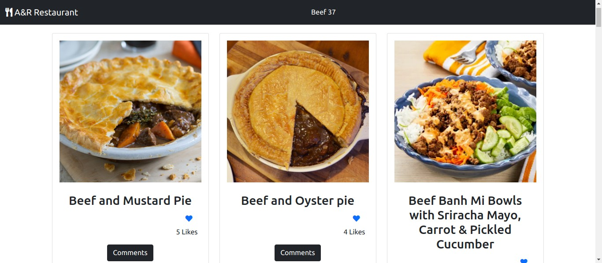

# Project Name

A & R Restaurant Website

This is a webapp that features an all beef cuisine. All meals are loaded from an external API where they are stored. The likes, and comments are also managed by external API's. 

# Screenshots

## Built With

- HTML
- JavaScript
- CSS3
- Bootstrap
- Webpack
- Jest

## Getting Started

To get a local copy up and running follow these simple example steps. You can either download the zip file, or clone the repository from [here](https://github.com/the-catalystmc/api-webapp). Once the repository is available locally you can use: `npm install` to install the packages `npm start` to run the server on local server.
To run tests `npm test` can be used.

👤 **Andres Felipe Castañeda Ramos**
- Github: [@afcastaneda223](https://github.com/afcastaneda223)
- Twitter: [@afcastaneda](https://twitter.com/afcastaneda)
- Linkedin: [Andres Felipe Castañeda](www.linkedin.com/in/andres-castaneda223)

👤 **Rhyine Stewart**

- GitHub: [@the-catalyst-mc](https://github.com/the-catalyst-mc)
- Twitter: [@catalystspeaks](https://twitter.com/catalystspeaks)
- LinkedIn: [Rhyine Stewart](https://linkedin.com/in/rhyinestewart)

## 🤝 Contributing

Contributions, issues, and feature requests are welcome!

Feel free to check the [issues page](https://github.com/the-catalystmc/api-webapp/issues).

## Show your support

Give a ⭐️ if you like this project!
